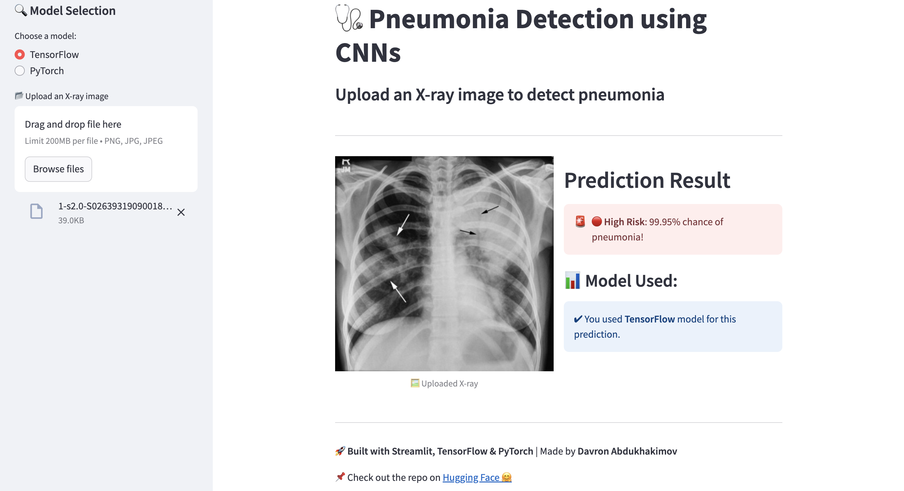

# 🩺 Pneumonia Detection using CNNs

This project is a **deep learning-based web application** built with **Streamlit**, allowing users to detect pneumonia from **chest X-ray images**. It provides predictions using **both TensorFlow and PyTorch models**.

## 🚀 Features

- Upload chest X-ray images for **pneumonia detection**.
- Choose between **TensorFlow** and **PyTorch** models for prediction.
- Real-time **prediction results** with confidence scores.
- **User-friendly UI** built with Streamlit.
- Hosted on **Hugging Face Spaces**.

## 🖥️ Tech Stack

- **Frontend**: Streamlit
- **Backend**: TensorFlow & PyTorch
- **Models**: ResNet50-based CNNs
- **Deployment**: Hugging Face Spaces

## 📸 Screenshots



## 📂 Installation

### 🔧 Prerequisites

Ensure you have Python installed (Python 3.8+ recommended) and install the dependencies:

```bash
pip install -r requirements.txt
```

### ▶️ Run the App

```bash
streamlit run app.py
```

## 🏥 How It Works

1. **Upload an X-ray image**.
2. **Select a model** (TensorFlow or PyTorch).
3. **Get predictions** with a confidence score.

## 📌 Model Details

- **TensorFlow Model**: Trained using `ResNetV2` and optimized for pneumonia detection.
- **PyTorch Model**: Based on `ResNet50` with a custom classifier.

## 🔗 Demo

Check out the live demo on [**Hugging Face 🤗**](https://huggingface.co/spaces/davron04/CNN_Pneumonia_detection)

---

\*\*Built with ❤️ by \*\*[**Davron Abdukhakimov**](https://github.com/davron2004-tech)

